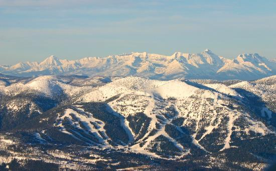

# Big Mountain Resort Pricing Model

## Introduction

In this project, we explored the application of various regression algorithms to predict ticket prices for Big Mountain resort using Springboard’s Data Science Method:

1. Problem identification
2. Data wrangling
3. Exploratory data analysis
4. Pre-processing and training data
5. Modelling
6. Documentation

We analyzed and preprocessed the dataset, selected relevant features, and implemented different regression models. The performance of each model is evaluated using metrics such as R-squared and Mean Absolute Error (MAE).

## Problem identification:
    
Big Mountain resort is a ski resort located in Montana, which has 105 trails and serves 350000 people every year. The resort has installed additional ski lift, which increases operating costs by $1,540,000 this season. The management want some guidance on how to select a better value for their ticket price. They are also considering changes that can either cut costs without undermining the ticket price or support an even higher ticket price. How can Big Mountain resort maximize its returns over the next ski season through better pricing strategy or some changes to current facility investment plans?

## Data wrangling:

Checked the percentage of missing values and outliers, corrected wrong input, removed irrelevant and useless features, analyzed distribution of resorts and ticket prices by states, created several new features and finally selected adult weekend ticket price as the target variable.

## Exploratory data analysis:

PCA analysis and visualization of high dimensional data found the features with high importance are: 
1. vertical drop
2. snow making area
3. number of total chairs
4. number of fast quads
5. number of runs
6. longest run length
7. number of trams
8. skiable area

## Pre-processing and training data

Split train set and test set before training.
1. **Linear Regression**: 
Implementation: created pipeline consist of imputer, standard scaler and linear regression. 
Assessment: cross validation with MAE and R-squared as metrics. 
Hyperparameter tuning: GridSearchCV and cross validation of best estimator. 
2. **Random Forest Regressor**: 
Implementation: created pipeline consist of imputer, standard scaler and random forest regressor. 
Assessment: cross validation with MAE and R-squared as metrics. 
Hyperparameter tuning: GridSearchCV and cross validation of best estimator. 

## Modeling:

Big Mountain Resort has been reviewing potential scenarios for either cutting costs or increasing revenue (from ticket prices). Ticket price is not determined by any set of parameters; the resort is free to set whatever price it likes. However, the resort operates within a market where people pay more for certain facilities, and less for others. Being able to sense how facilities support a given ticket price is valuable business intelligence. This is where the utility of our model comes in.

The business has shortlisted some options:
1. Permanently closing down up to 10 of the least used runs. This doesn't impact any other resort statistics.
2. Increase the vertical drop by adding a run to a point 150 feet lower down but requiring the installation of an additional chair lift to bring skiers back up, without additional snow making coverage
3. Same as number 2, but adding 2 acres of snow making cover
4. Increase the longest run by 0.2 mile to boast 3.5 miles length, requiring an additional snow making coverage of 4 acres

The expected number of visitors over the season is 350,000 and, on average, visitors ski for five days. Assume the provided data includes the additional lift that Big Mountain recently installed.

## Documentation:  
1. **Pricing Recommendation**:  
Based on the market position and facilities of Big Mountain resort, the model suggest the ticket price of Big Mountain should be $95.87±10.39, first increase the ticket price from $81 to $85.48 and monitor the daily increase of revenue and validate with sale information. If it continues, increase the price to maximum of $106.26. 
2. **Improvement Suggestion**: 
   2.1 close one least used run, which will not influence the revenue. 
   2.2 close five least used run and monitor the reduce of operation cost and revenue changes. 
   2.3 increase the vertical drop by adding a run to a point 150 feet lower down with installation of an additional chair lift without additional snow making coverage, which will increase revenue roughly $3 million.

## Future Work: 
The deficiency in the data is that the operation cost is unknown. Cost information will be helpful to improve the performance of the models. 
To make machine learning models available for business analysts to use, it is necessary to deploy the trained models in a production environment where they can be accessed by business analysts, such as cloud-based services.
